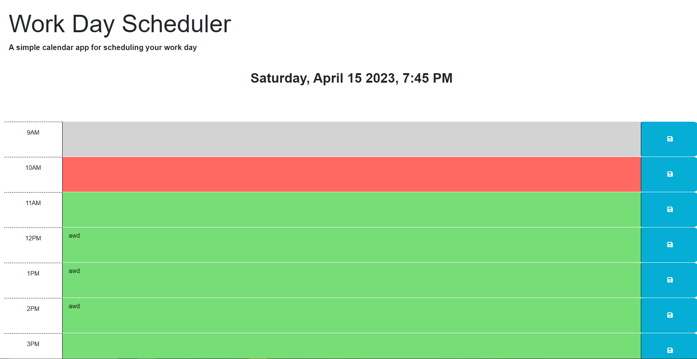
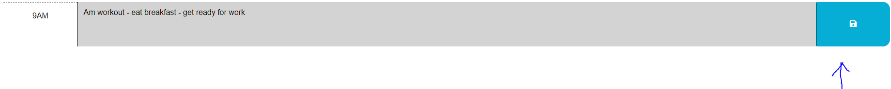

# Day-planner


## Description


With this easy to use application you can plan out your day from a 9-5 schedule.


Simply type in your plans for a certain hour and click the save button.




## Table of Contents


- [Installation](#installation)
- [License](#license)
- [Questions](#questions)


## Installation


To install necessary dependencies, run the following command:


```
Simply open the link provided and save your data no installation required.
```


## License

 [MIT](https://opensource.org/licenses/MIT)

## Questions


If you have any questions about the repo, open an issue or contact me directly at mathewandnana@gmail.com. You can find more of my work at NRDmatt.

